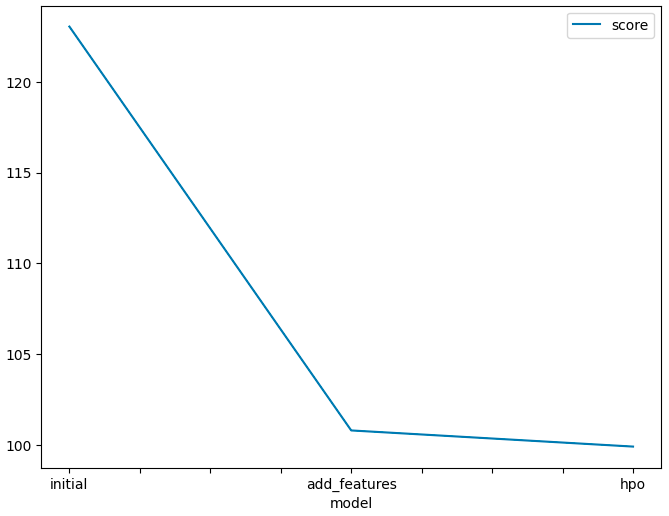
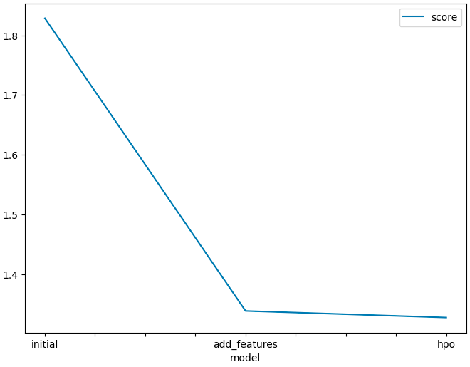

# Report: Predict Bike Sharing Demand with AutoGluon Solution
#### NGO TRI HOANG ANH (ANHNTH16 FPT)

## Initial Training
### What did you realize when you tried to submit your predictions? What changes were needed to the output of the predictor to submit your results?
The submittion does not accept negative value. Therefore, before submittion, all the predicted negative values need to be converted to zero.

### What was the top ranked model that performed?
The top rank model is the model which has all the data type in correct format, and the hyperparameter is auto-tuned.  

## Exploratory data analysis and feature creation
### What did the exploratory analysis find and how did you add additional features?
I look at the data histogram plot, there is a missing component (datetime column). 
For a regression model, the basic idea is to predict the future value/outcome base on the data in the past. If we assume the bike sharing have a period demand base on year, then the datetime column would have values imformation in it.
Since the datetime data is different for each row, I decided to extract only the the weekday component from the column and convert it in catergory data-type.

### How much better did your model preform after adding additional features and why do you think that is?
The model loss decrease from 1.80 to 1.34 on the validation dataset. 
If we look at the validation dataset, we can see that it require us to predict the bike sharing demand base datetime values. Therefore, the increase in preformance is because the newly added feature has value information in predicting bike sharing demand.

## Hyper parameter tuning
### How much better did your model preform after trying different hyper parameters?
The model loss decrease from 1.34 to 1.32 on the validation dataset. 

### If you were given more time with this dataset, where do you think you would spend more time?
I would focus model on creating new feature first because it seen to be there still more feature can be manually extracted.

### Create a table with the models you ran, the hyperparameters modified, and the kaggle score.
|model|weekday_feature|train_test_split|hyperparameter_tune_kwargs|score|
|--|--|--|--|--|
|initial|False|False|False|1.83|
|add_features|True|False|False|1.34|
|hpo|True|True|True|1.33|

### Create a line plot showing the top model score for the three (or more) training runs during the project.

I take the Root Mean Square Error as the top model score for each model.
Since the autogluon run under assumption that higher score mean better performance, therefore it use negative RMSE (link below).
To plot the model scores, I inverse it back to normal RMSE and plot the score.
https://github.com/autogluon/autogluon/issues/524

### Create a line plot showing the top kaggle score for the three (or more) prediction submissions during the project.

The model score is the retrieval predicted score from Kaggle on test dataset.

## Summary
In this project, I try to predict the demand for bike sharing from the bike_sharing_demand contest on Kaggle using automation machine learning package call autogluon.
The project is conducted on local PC and push to git server. Conda is used for development enviroment management.
I first run the pylot test on the dataset with autogluon TabularPredictor, the test score is on the low-end of the ranking which about 1.82.
I plot the barchart for each data feature and look at the data type, I found out that the data type in the datetime column is chart type instead of daytime type. 
I assume that the the demand for bike sharing is periodic. Therefore, extract information related to daytime can be value for demand prediction. 
The weekday is extracted from daytime column and weekday, season, weather data type is change from interger to category.
The test score for the model trained with new feature change to 1.33.
Finally, we perform hyperparameter tuning by set hyperparameter_tune_kwargs to auto, and devide the train data set to train and validation set.
The result only increase to 1.32.
The result indicate that the current feature is not enough to demonstrate the regression model of bike_sharing_demand dataset.
Therefore, newer feature need to be added for improvement in test score.
